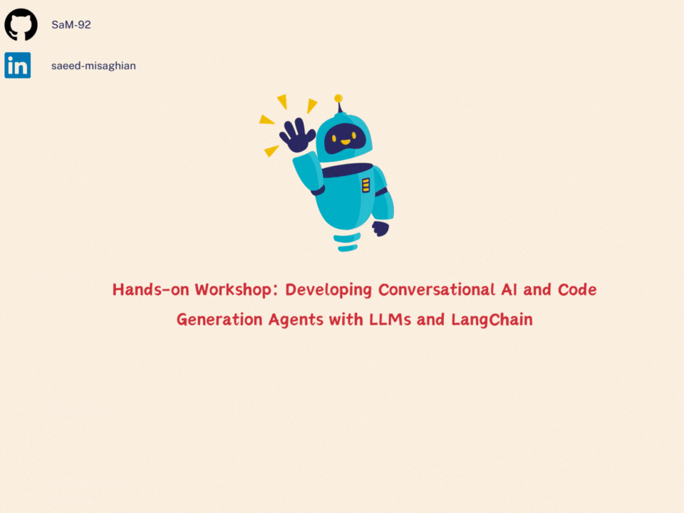

# GenAI Workshop

**Knowledge Sharing Session on Using LLM APIs**

This workshop provides an introduction to using Large Language Model (LLM) APIs in Python. Participants will learn the basics of invoking LLMs, specifying roles, and creating agents. This session aims to equip attendees with the foundational skills needed to effectively work with LLMs and leverage their capabilities in various applications.

**Topics to be covered:**

- Introduction to LLMs in Python
- How to invoke LLM APIs
- Specifying roles within LLMs
- Creating and managing agents

Explore the basics of LLMs and enhance your understanding of how to integrate these powerful tools into your projects.

# Create API Token

Check out this tutorial on how to create an API token for Together AI:

In this video, you'll learn:

- Where to find the API token creation page.
- How to navigate through the settings.
- Step-by-step instructions to generate and copy your API token.
- Tips and best practices for managing your API tokens.

Visit [Together AI](https://www.together.ai) for more information and creating the API token.
